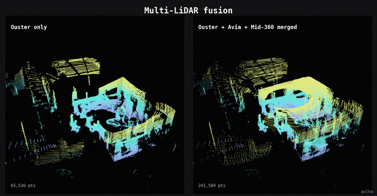
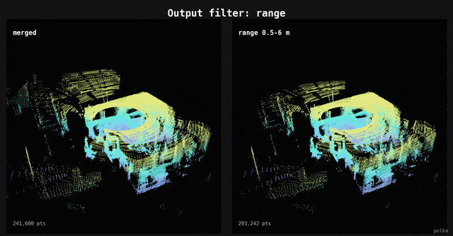
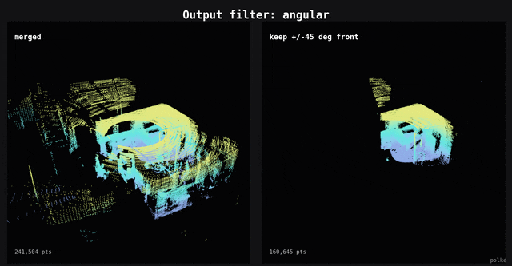
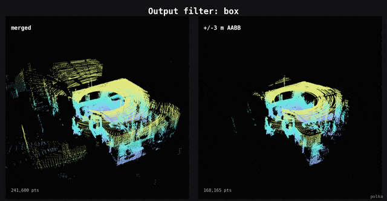
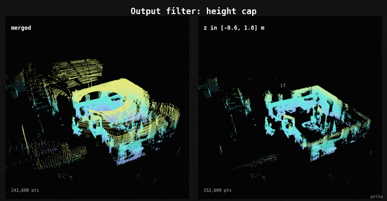
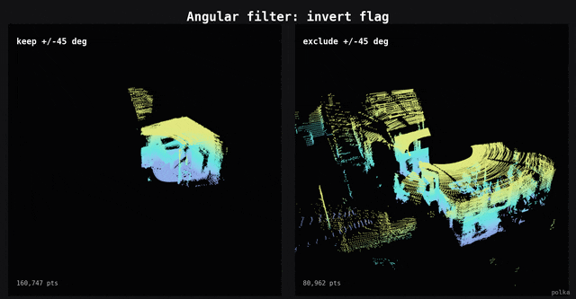
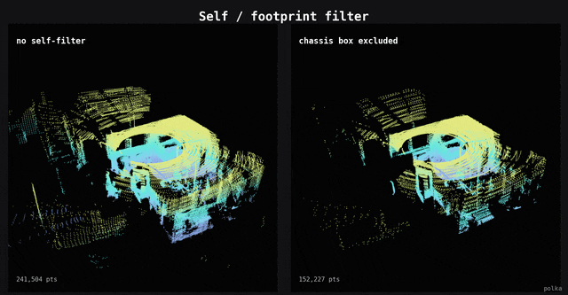
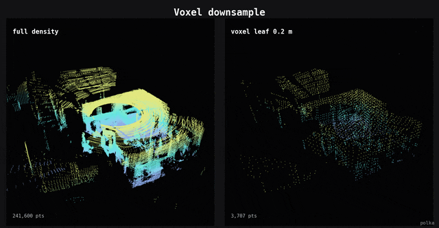
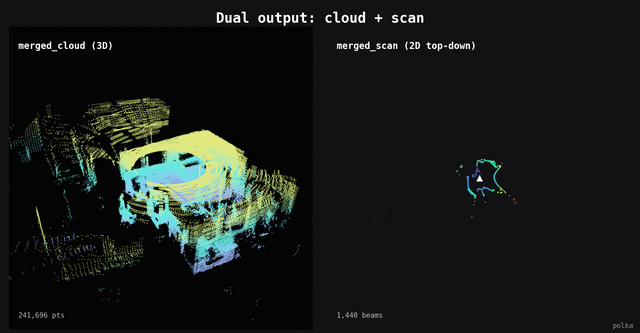
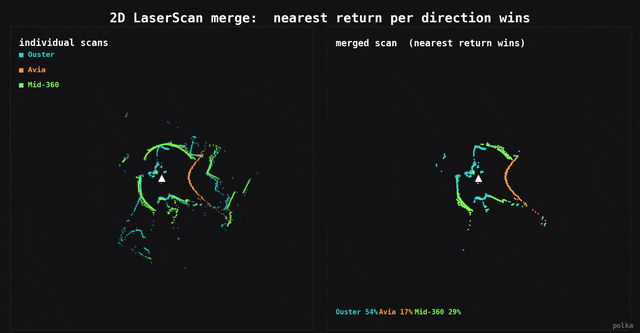

# POLKA

<p align="center">
  <a href="https://github.com/Pana1v/polka/tree/humble"></a>
  <a href="https://github.com/Pana1v/polka/tree/iron"></a>
  <a href="https://github.com/Pana1v/polka/tree/jazzy"></a>
  <a href="https://github.com/Pana1v/polka/tree/kilted"></a>
  <a href="https://github.com/Pana1v/polka/tree/lyrical"></a>
  <br/>
  
  
  
  <br/>
  
  
  
  
  <br/>
  <a href="LICENSE"></a>
  <a href="https://github.com/Pana1v/polka/stargazers"></a>
  <a href="https://github.com/Pana1v/polka/issues"></a>
  <a href="https://github.com/Pana1v/polka/commits"></a>
</p>

<p align="center">
  
</p>

<p align="center">
  
  <br/>
  <em>Multi-LiDAR fusion: one spinning Ouster vs. Ouster + Livox Avia + Mid-360 merged into a single cloud.</em>
</p>

**Multi-LiDAR fusion node for ROS 2.** Merges any mix of PointCloud2 and LaserScan sources into a unified PointCloud2 and/or LaserScan, with per-source and output filtering, IMU deskewing, and optional CUDA acceleration. One composable node replaces a relay / filter / transform / merge / downsample chain.

## Features in action

Each clip runs polka with a different config on the [TIERS multi-LiDAR dataset](https://github.com/TIERS/multi_lidar_multi_uav_dataset) (Ouster OS1 + Livox Avia + Mid-360), rendered headless with Open3D. See [`doc/media/`](doc/media/) to regenerate.

<table>
<tr>
<td width="50%"><br/><em>Range filter: keep points within a distance shell</em></td>
<td width="50%"><br/><em>Angular filter: keep a yaw sector</em></td>
</tr>
<tr>
<td width="50%"><br/><em>Box filter: crop to an axis-aligned box</em></td>
<td width="50%"><br/><em>Height cap: clip to a z-range</em></td>
</tr>
<tr>
<td width="50%"><br/><em>Angular <code>invert</code> flag: keep vs. exclude a sector</em></td>
<td width="50%"><br/><em>Self-filter: remove the robot's own footprint</em></td>
</tr>
<tr>
<td width="50%"><br/><em>Voxel downsample: 69k to 5k points</em></td>
<td width="50%"><br/><em>Dual output: merged cloud plus flattened 2D scan</em></td>
</tr>
<tr>
<td colspan="2" align="center"><br/><em>2D LaserScan merge: each beam colored by the sensor with the nearest return</em></td>
</tr>
</table>

## Features

- **Heterogeneous fusion**: mix 3D PointCloud2 and 2D LaserScan sources freely
- **Dual output**: merged PointCloud2, LaserScan, or both at once
- **Per-source and output filtering**: range, angular, box, height cap, footprint (ego-body) exclusion, voxel downsample
- **IMU deskewing**: per-point SE(3) motion correction, with per-point timestamp auto-detect
- **CUDA acceleration**: optional GPU merge engine, falls back to CPU
- **TF2 integration**: automatic lookup with last-known-good fallback
- **Fully parameterized and composable**: runtime ROS 2 params; standalone or in a component container

## Install

Each ROS 2 distro has its own code-identical branch:

| Distro | Ubuntu | Branch |
|--------|--------|--------|
| Humble | 22.04 | [`humble`](../../tree/humble) |
| Iron | 22.04 | [`iron`](../../tree/iron) |
| Jazzy | 24.04 | [`jazzy`](../../tree/jazzy) |
| Kilted | 24.04 | [`kilted`](../../tree/kilted) |
| Lyrical | 26.04 | [`lyrical`](../../tree/lyrical) |

```bash
git clone -b humble https://github.com/Pana1v/polka.git ~/ros2_ws/src/polka
cd ~/ros2_ws && colcon build --packages-select polka
# add  --cmake-args -DWITH_CUDA=ON  for the GPU merge engine
```

## Quick start

```bash
cp config/example_params.yaml config/my_robot.yaml      # edit topics + output_frame_id
ros2 launch polka polka.launch.py config_file:=config/my_robot.yaml
```

Set `output_frame_id` to your base frame, list sensors under `source_names`, and make sure TF resolves each sensor `frame_id` to `output_frame_id`. Replaying a bag? Pass `use_sim_time:=true` and play with `--clock` (see [Configuration](doc/CONFIGURATION.md#rosbag--simulation-playback)).

## Documentation

- **[Configuration](doc/CONFIGURATION.md)**: every parameter, filters, IMU deskewing, rosbag playback
- **[Pipeline and architecture](doc/PIPELINE.md)**: what polka replaces, internal stages, file layout
- **[Maintaining distro branches](MAINTAINING.md)**: single-source-of-truth sync across the five branches

## License and credits

Apache-2.0. The per-point deskewing motion model is inspired by [rko_lio](https://github.com/TixiaoShan/rko_lio) (Malladi et al., 2025, [arXiv:2509.06593](https://arxiv.org/pdf/2509.06593)).
