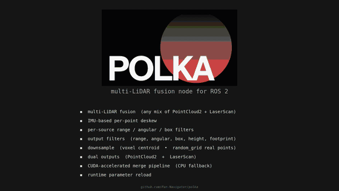
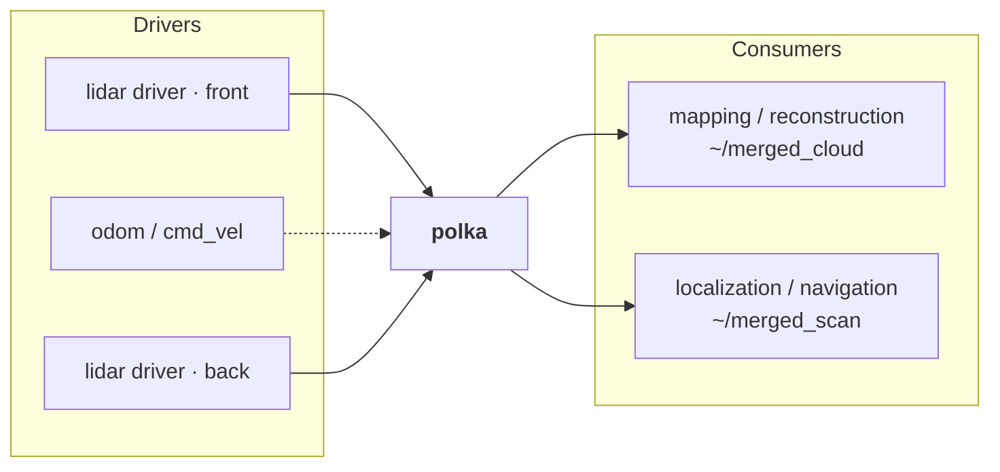
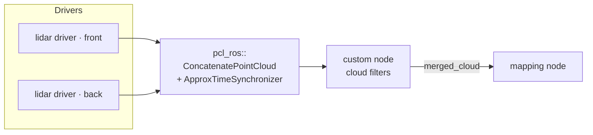
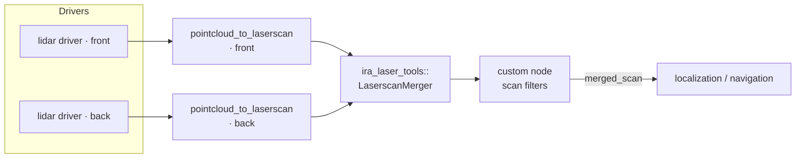
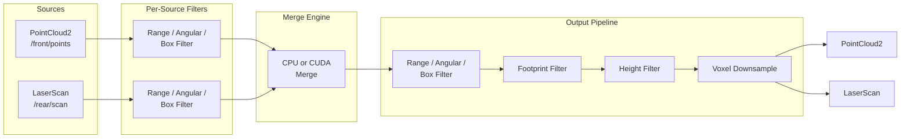

# POLKA

<p align="center">
  <a href="https://github.com/Pana1v/polka/tree/humble"></a>
  <a href="https://github.com/Pana1v/polka/tree/iron"></a>
  <a href="https://github.com/Pana1v/polka/tree/jazzy"></a>
  <a href="https://github.com/Pana1v/polka/tree/kilted"></a>
  <a href="https://github.com/Pana1v/polka/tree/lyrical"></a>
  <br/>
  
  
  
  <br/>
  <a href="LICENSE"></a>
  <a href="https://github.com/Pana1v/polka/stargazers"></a>
  <a href="https://github.com/Pana1v/polka/issues"></a>
  <a href="https://github.com/Pana1v/polka/commits"></a>
</p>

<p align="center">
  
</p>

<p align="center">
  
  <br/>
  <em>Pipeline stages: raw &rarr; deskew &rarr; per-source filter &rarr; merge &rarr; output filter &rarr; voxel &mdash; <a href="media/">regenerate</a></em>
</p>


**Multi-LiDAR fusion node for ROS 2** that merges any mix of PointCloud2 and LaserScan sources into a unified output, with optional CUDA GPU acceleration.

## Supported ROS 2 Distributions

Each distro has its own branch. The branches are kept in sync from a single source of
truth — see [Maintaining distro branches](#maintaining-distro-branches).

| Distro  | Codename  | Ubuntu | Branch |
|---------|-----------|--------|--------|
| Humble  | Hawksbill | 22.04  | [`humble`](../../tree/humble) |
| Iron    | Irwini    | 22.04  | [`iron`](../../tree/iron) |
| Jazzy   | Jalisco   | 24.04  | [`jazzy`](../../tree/jazzy) |
| Kilted  | Kaiju     | 24.04  | [`kilted`](../../tree/kilted) |
| Lyrical | Luth      | 26.04  | [`lyrical`](../../tree/lyrical) |

```bash
# Clone the branch matching your distro
git clone -b humble  https://github.com/Pana1v/polka.git  # Humble  (22.04)
git clone -b iron    https://github.com/Pana1v/polka.git  # Iron    (22.04)
git clone -b jazzy   https://github.com/Pana1v/polka.git  # Jazzy   (24.04)
git clone -b kilted  https://github.com/Pana1v/polka.git  # Kilted  (24.04)
git clone -b lyrical https://github.com/Pana1v/polka.git  # Lyrical (26.04)
```

Polka replaces multi-node pipelines (relay -> filter -> transform -> merge -> downsample) with a single composable node, dramatically reducing latency, CPU overhead, and configuration complexity.

## Why Polka?

Managing multiple LiDAR sensors in ROS 2 typically requires a chain of separate nodes, each adding overhead, latency, and failure points. Polka collapses this entire pipeline into one composable node:

- **Deep per-source filtering**: every sensor gets its own range, angular, and box filter pass before any data enters the merge stage, so you never waste bandwidth merging garbage
- **Multi-modal merging**: fuse 3D PointCloud2 and 2D LaserScan sources together in a single merge step, no separate projection or relay nodes needed
- **Unified output**: emit merged PointCloud2, LaserScan, or both simultaneously from a single node
- **Rich output filtering**: after merge, apply range, angular, box, height filter, footprint filter (ego-body exclusion), and voxel downsampling in a defined, consistent order
- **CUDA GPU acceleration**: the merge engine can run entirely on GPU with fused kernels and pre-allocated buffers, cutting merge latency significantly on sensor-dense platforms
- **IMU-based deskewing**: per-point motion correction using the SE(3) exponential map removes intra-scan distortion, plus inter-source alignment eliminates ghosting artifacts during robot motion
- **TF2 integration**: transforms are resolved automatically, with fallback to the last known good transform so a momentary TF dropout does not drop the entire output

## Features

- **Heterogeneous source fusion**: mix 3D PointCloud2 and 2D LaserScan sensors freely
- **Dual output**: publish merged PointCloud2, LaserScan, or both simultaneously
- **Per-source filtering**: range, angular, and box filters applied before merge
- **Output filtering**: range, angular, box, height filter, footprint filter (ego-body exclusion), voxel downsampling
- **IMU-based deskewing**: per-point SE(3) motion correction using IMU angular velocity and acceleration, with auto-detection of per-point timestamp fields
- **CUDA acceleration**: optional GPU merge engine with fused kernels and pre-allocated buffers
- **TF2 integration**: automatic transform lookup with fallback to last known good transform
- **Full runtime reconfiguration**: filters, outputs, deskewing, and even the source list itself can be changed live via `ros2 param set` — no restart (see [Runtime Reconfiguration](#runtime-reconfiguration))
- **Diagnostics & drift flags**: per-source rate/bandwidth/lag on `/diagnostics`, with timing-drift and rate-drift detection (see [Diagnostics & Drift Detection](#diagnostics--drift-detection))
- **Composable node**: runs standalone or loaded into a component container

## Dependencies

| Package | Purpose |
|---|---|
| `rclcpp` / `rclcpp_components` | ROS 2 node framework |
| `sensor_msgs` | PointCloud2, LaserScan messages |
| `sensor_msgs` (Imu) | IMU data for motion compensation / deskewing |
| `tf2_ros` / `tf2_eigen` | Frame transforms |
| `pcl_conversions` | PCL <-> ROS message conversion |
| `laser_geometry` | LaserScan -> PointCloud2 projection |
| `diagnostic_msgs` | Diagnostics publishing (`/diagnostics`) |
| CUDA toolkit | **Optional** -- only needed for GPU merge engine |

## Build

```bash
# CPU only
cd ~/ros2_ws
colcon build --packages-select polka

# With CUDA support
colcon build --packages-select polka --cmake-args -DWITH_CUDA=ON
```

## Quick Start

1. Copy and edit the example config:
   ```bash
   cp config/example_params.yaml config/my_robot.yaml
   ```

2. Set `output_frame_id` to your robot's base frame (e.g. `base_link`)

3. List your sensors under `source_names` and configure each source's topic, type, and filters

4. Ensure TF is published from each sensor's `frame_id` to `output_frame_id`

5. Launch:
   ```bash
   ros2 launch polka polka.launch.py config_file:=config/my_robot.yaml
   ```

## Rosbag / Simulation Playback

The default configuration targets **live sensor data** and runs on the system (wall)
clock. The `source_timeout` staleness check (`0.5 s` by default) compares each message's
header stamp against the node clock, so when you replay a rosbag — whose stamps are
historical — every source is immediately judged stale and **no merged cloud is
published**. Most people hit this the first time they test with a bag.

To replay a bag correctly, enable simulated time **and** play the bag with `--clock` so
the node's clock tracks bag time:

```bash
ros2 launch polka polka.launch.py use_sim_time:=true
ros2 bag play <bag> --clock
```

| Argument | Default | Description |
|---|---|---|
| `use_sim_time` | `false` | Set `true` for rosbag/simulation replay; the node then uses ROS time driven by `/clock`. |

If the node detects a clock/timestamp mismatch it prints a single actionable warning
naming the fix, so you don't have to guess:

- Bag stamps far behind the system clock (`use_sim_time` left `false`) → reminds you to
  set `use_sim_time:=true` and play with `--clock`.
- `use_sim_time:=true` but nothing publishes `/clock` → reminds you to add `--clock`.
  (In this state the clock is frozen, so clouds may still flow on an undefined stamp —
  always pass `--clock` for correct timing.)

## Configuration

All parameters live under the `polka` namespace. [config/example_params.yaml](config/example_params.yaml) is a minimal starter; see [config/detailed_params.yaml](config/detailed_params.yaml) for the full annotated reference of every parameter.

### Minimal Config

```yaml
polka:
  ros__parameters:
    output_frame_id: "base_link"
    output_rate: 20.0
    source_names: ["front_3d", "rear_2d"]
    sources:
      front_3d:
        topic: "/front_lidar/points"
        type: "pointcloud2"
      rear_2d:
        topic: "/rear_lidar/scan"
        type: "laserscan"
    outputs:
      cloud:
        enabled: true
      scan:
        enabled: true
```

Everything else has sensible defaults. Add filters, deskewing, and GPU acceleration as needed.

### Key Parameters

| Parameter | Default | Description |
|---|---|---|
| `output_frame_id` | `"base_link"` | Target frame for all merged output |
| `output_rate` | `20.0` | Merge + publish rate (Hz) |
| `source_timeout` | `0.5` | Drop source if no data within this window (s) |
| `enable_gpu` | `true` | Use CUDA merge engine when available (falls back to CPU) |
| `timestamp_strategy` | `"earliest"` | Output stamp: `earliest`, `latest`, `average`, or `local` |

### Per-Source Parameters

| Parameter | Default | Description |
|---|---|---|
| `sources.<name>.topic` | `""` | Subscription topic (required) |
| `sources.<name>.type` | `"pointcloud2"` | `"pointcloud2"` or `"laserscan"` |
| `sources.<name>.imu_topic` | `""` | Per-source IMU override (empty = use global) |
| `sources.<name>.qos_reliability` | `"best_effort"` | `"best_effort"` or `"reliable"` |
| `sources.<name>.qos_history_depth` | `1` | QoS queue depth |

### Motion Compensation (IMU Deskewing)

Corrects for robot motion during LiDAR scans using IMU data. Per-point deskewing uses the SE(3) exponential map motion model with angular velocity and linear acceleration from IMU, applied to each point based on its per-point timestamp. Inter-source alignment corrects for timing offsets between different sensors.

The motion model is inspired by [rko_lio](https://github.com/TixiaoShan/rko_lio) (Malladi et al., 2025).

```yaml
motion_compensation:
  enabled: true
  imu_topic: "/imu/data"          # sensor_msgs/Imu topic (global, used by all sources)
  max_imu_age: 0.2                # seconds - reject stale IMU
  imu_buffer_size: 200            # ring buffer (~1s at 200Hz)
  per_point_deskew: true          # per-point correction within each scan
  deskew_timestamp_field: "auto"  # auto-detects 'time', 't', 'timestamp', etc.
```

#### Per-Source IMU Override

Articulated platforms (hinged vehicles, manipulators, humanoids, rotating turrets) can override the IMU on a per-source basis: each moving sensor reads an IMU rigidly mounted to the moving body, while fixed sensors share the global platform IMU. polka uses TF to rotate both angular velocity and linear acceleration from the IMU frame into each sensor's frame, so `robot_state_publisher` must keep the IMU→sensor transform current — a dynamic transform (e.g. driven by joint_states from a turret encoder) works out of the box.

```yaml
motion_compensation:
  enabled: true
  imu_topic: "/imu/data"          # global fallback IMU

sources:
  turret_lidar:
    topic: "/turret/points"
    imu_topic: "/turret/imu/data" # per-source override
  chassis_lidar:
    topic: "/chassis/points"
    # imu_topic omitted — falls back to /imu/data
```

A working two-source setup is in [`config/example_articulated_imu.yaml`](config/example_articulated_imu.yaml). The global `motion_compensation.imu_topic` remains the recommended path for fully rigid platforms.

**Per-point timestamp auto-detect.** With `deskew_timestamp_field: "auto"` polka scans each `PointCloud2` for one of: `time`, `t`, `timestamp`, `time_stamp`, `offset_time`, `timeStamp`. Set a specific name if your driver uses something else; if no usable field is present polka logs once and falls back to whole-scan (non-per-point) deskewing for that source.

**Gravity subtraction.** Gravity is subtracted from `linear_acceleration` only when the IMU publishes a valid orientation: `orientation_covariance[0] >= 0` and a non-degenerate quaternion. Otherwise acceleration is zeroed and deskewing is rotation-only — still useful, but translation during the scan is not corrected.

### Output Filters

Applied to the merged cloud before publishing, in this order:

1. **Output filters** (range / angular / box)
2. **Footprint filter** -- removes points inside robot body exclusion zones
3. **Height filter** -- clips to `[z_min, z_max]`
4. **Voxel downsample** -- reduces density via VoxelGrid

```yaml
outputs:
  cloud:
    height_cap:
      enabled: true
      z_min: -1.0
      z_max: 3.0
    voxel:
      enabled: true
      leaf_size: 0.05
    self_filter:
      enabled: true
      box_names: ["chassis"]
      chassis:
        x_min: -0.30
        x_max:  0.30
        y_min: -0.25
        y_max:  0.25
        z_min: -0.10
        z_max:  0.50
```

## Runtime Reconfiguration

Every polka parameter can be changed live through the standard ROS 2 parameter
services — no custom service types, so `ros2 param`, rqt, and Foxglove all work:

```bash
# Tighten a source's range filter while the robot runs
ros2 param set /polka sources.front_3d.filters.range.enabled true
ros2 param set /polka sources.front_3d.filters.range.max 4.0

# Add a source at runtime: declare the name first, then set its topic
ros2 param set /polka source_names "['front_3d', 'rear_2d', 'aux']"
ros2 param set /polka sources.aux.topic "/aux_lidar/points"

# Remove it again (its parameters keep their values for a later re-add)
ros2 param set /polka source_names "['front_3d', 'rear_2d']"
```

Invalid values are rejected atomically with a human-readable reason
(`ros2 param set /polka sources.front_3d.filters.range.min -1.0` →
`"sources.front_3d.filters: min_range must be non-negative"`), and nothing is
applied until the whole proposed set validates.

How each parameter group takes effect:

| Parameter group | Applied by |
|---|---|
| `sources.<n>.filters.*` | Filter chain rebuilt in place |
| `sources.<n>.topic` / `.type` / `.qos_*` / `.imu_topic` | That source's subscription recreated |
| `source_names` | Sources added/removed by name (a new name without a topic stays *pending* until the topic is set) |
| `output_rate` | Output timer recreated |
| `outputs.*.enabled` / `.topic` / `.qos.*` | Publisher created/destroyed/recreated |
| `outputs.cloud.filters/voxel/height_cap/self_filter.*`, `outputs.scan.*` | Output pipeline reconfigured in place |
| `motion_compensation.*` | IMU buffer and/or source subscriptions recreated as needed |
| `diagnostics.*` | Drift trackers and diagnostics timer reconfigured |
| `timestamp_strategy`, `source_timeout`, `point_timestamps.*`, ... | Take effect on the next output tick |
| `enable_gpu` | **Read-only** — the merge engine is constructed once at startup |

Thread-safety note: all of polka's callbacks share the node's default mutually
exclusive callback group, so reconfiguration is serialized against data
processing under both single- and multi-threaded executors. Do not move
polka's callbacks into a reentrant group, and do not call `set_parameters()`
on the node object from a thread that is not spinning it.

## Diagnostics & Drift Detection

polka publishes `diagnostic_msgs/DiagnosticArray` on `/diagnostics` (default
1 Hz, `diagnostics.enabled: true`), readable by `rqt_robot_monitor`,
`diagnostic_aggregator`, PlotJuggler, or plain `ros2 topic echo`:

- **`polka: node`** — engine (CPU/CUDA), fresh/pending source counts, uptime, reconfigure count
- **`polka: output`** — publish rate, output bandwidth, points in/out per tick, last-publish age
- **`polka: source <name>`** — per-source rate, bandwidth, message age, stamp offset
  vs. peer median, filter drop percentage, status (`OK`, stale, pending, drifting),
  and which capabilities are actually active (range/angular/box filters, deskewing)

Two drift detectors run per source, each raising a `WARN` diagnostic plus a log
line only after `min_ticks` consecutive bad ticks (and clearing with
hysteresis, so a jittery boundary can not flap the flag):

- **Timing drift** — the EWMA of a source's stamp offset from the peer median
  exceeds `diagnostics.timing_drift.threshold_sec`. Catches a sensor whose
  clock or driver latency is walking away from the others.
- **Rate drift** — the observed rate sags more than `diagnostics.rate_drift.sag_pct`
  below the expected rate (`sources.<n>.expected_rate`, or auto-baselined from
  the first `baseline_sec` of traffic). Catches a lagging sensor that is alive
  but degraded — a fully dead source is flagged *stale* instead.

All thresholds are runtime-reconfigurable. See the `diagnostics:` block in
[config/detailed_params.yaml](config/detailed_params.yaml).

### Terminal Dashboard

`polka_monitor` is an optional terminal UI built on the diagnostics above — no
GUI, no rviz, works over SSH and inside `docker exec`. It subscribes to
`/diagnostics`, `/rosout`, and the merged output topics (which it discovers
automatically from the diagnostics), so it never adds load to the merge path.

```bash
ros2 run polka polka_monitor            # any terminal, while polka runs
ros2 run polka polka_monitor --node polka --rate 4.0   # redraws/sec, default 4.0
```

On terminals at least 130 columns wide, the dashboard lays out in three
columns; narrower terminals drop the capabilities column:

- **Left — capabilities**: engine (CPU/CUDA), output topics, and per-source
  type/rate-mode/active-filters/deskew status, straight from `/diagnostics`.
- **Middle — views**: Braille-rendered top (x-y) and side (x-z) views of the
  merged cloud, with the merged scan overlaid on the top view. Density shades
  the dots; the extent auto-scales (toggle to a fixed extent with `f`).
- **Right**: a per-source table (rate, bandwidth, message age, stamp offset,
  filter drop %) colored by status, plus a live warning feed colored per
  source (when the message names one) that merges polka's `/rosout` warnings
  with stale/drift transitions.
- **Keys**: `q` quit, `f` fixed/auto extent, `v` toggle views, `p` pause feed.

It is opt-in and changes nothing about the node's normal operation. To run it in
the same terminal as a launch, pass `dashboard:=true` (the node's logs are
redirected to the log file so they don't fight the UI):

```bash
ros2 launch polka polka.launch.py dashboard:=true config_file:=<your>.yaml
```

Running `polka_monitor` in a second terminal is the simplest path and always
works; the `dashboard:=true` route additionally re-attaches the UI to the
controlling terminal, which `ros2 launch` otherwise does not provide.

## Pipeline Comparison

### polka (1 node)



### pcl_ros chain (7+ nodes)

Cloud path:



Scan path:



## Architecture



## File Structure

```
polka/
├── config/
│   ├── example_params.yaml          # Minimal starter config
│   ├── detailed_params.yaml        # Full annotated parameter reference
│   └── example_articulated_imu.yaml # Per-source IMU deskewing example
├── launch/polka.launch.py          # Launch file
├── include/polka/
│   ├── polka_node.hpp              # Main composable node (orchestration only)
│   ├── types.hpp                   # Config structs and type definitions
│   ├── config/
│   │   └── config_loader.hpp       # Parameter loading and hot-reload
│   ├── input/
│   │   ├── source_adapter.hpp      # Subscribes to and converts sensor data
│   │   └── imu_buffer.hpp          # IMU ring buffer with atomic snapshot
│   ├── filters/
│   │   ├── i_filter.hpp            # Filter interface
│   │   ├── filter_chain.hpp        # Factory: build a filter chain from FilterParams
│   │   ├── range_filter.hpp        # Min/max distance filter
│   │   ├── angular_filter.hpp      # Angular sector filter
│   │   └── box_filter.hpp          # Axis-aligned box filter (+ invert for self filter)
│   ├── merge_engine/
│   │   ├── i_merge_engine.hpp      # Merge engine interface
│   │   ├── cpu_merge_engine.hpp    # CPU merge implementation
│   │   ├── cuda_merge_engine.hpp   # CUDA GPU merge implementation
│   │   └── cuda_types.cuh          # GPU type definitions
│   ├── output/
│   │   ├── output_pipeline.hpp     # Post-merge processing (filter, height cap, voxel)
│   │   └── scan_builder.hpp        # LaserScan assembly from cloud or range vector
│   └── util/
│       ├── qos_builder.hpp         # build_qos() for output publishers
│       ├── se3_exp.hpp             # SE(3) exponential map for motion compensation
│       └── log_format.hpp          # Log throttle constants
└── src/
    ├── main.cpp                    # Entry point
    ├── polka_node.cpp              # Node implementation
    ├── config_loader.cpp
    ├── source_adapter.cpp
    ├── imu_buffer.cpp
    ├── filters/                    # Filter implementations
    ├── merge_engine/               # Merge engine implementations
    └── output/                     # OutputPipeline and ScanBuilder implementations
```

## Acknowledgments

The per-point deskewing motion model (SE(3) exponential map with constant-acceleration + constant-angular-velocity) is inspired by rko_lio:

```bibtex
@article{malladi2025arxiv,
  author  = {M.V.R. Malladi and T. Guadagnino and L. Lobefaro and C. Stachniss},
  title   = {A Robust Approach for LiDAR-Inertial Odometry Without Sensor-Specific Modeling},
  journal = {arXiv preprint},
  year    = {2025},
  volume  = {arXiv:2509.06593},
  url     = {https://arxiv.org/pdf/2509.06593},
}
```

## Maintaining distro branches

polka supports five ROS 2 distros from five branches that are intentionally **code-identical**.
To keep them in sync without N× the work, development follows a single-source-of-truth model:

- **Develop once, on `humble`** (the oldest supported distro = most conservative API). Code that
  compiles on Humble compiles forward to Lyrical far more reliably than the reverse.
- **Fan out, don't hand-pair.** A merged change on `humble` is propagated to the other branches with
  [`scripts/sync-distros.sh`](scripts/sync-distros.sh) — no more manual `-jazzy`/`-kilted` siblings.
- **Where a distro's API genuinely differs**, branch *inside the source file* with a compile-time
  guard so the branches stay identical, e.g.:
  ```cpp
  #if __has_include(<cv_bridge/cv_bridge.hpp>)
  #  include <cv_bridge/cv_bridge.hpp>   // Jazzy / Kilted / Lyrical
  #else
  #  include <cv_bridge/cv_bridge.h>      // Humble / Iron
  #endif
  ```
- **A CI matrix** ([`.github/workflows/ci.yml`](.github/workflows/ci.yml)) builds the package against
  every distro on each push/PR — the safety net that catches per-distro drift automatically.

Full details and the contributor workflow are in [MAINTAINING.md](MAINTAINING.md).

## License

Apache-2.0
